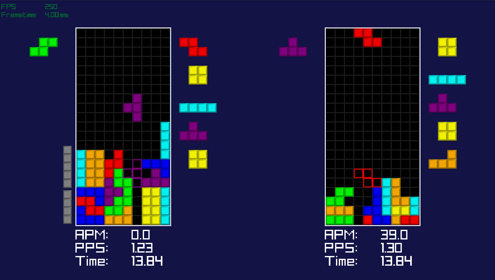

# A small Tetris game



A Tetris Game in C, my first project while learning C a few months ago, now with added
[Cold Clear](https://github.com/MinusKelvin/cold-clear) integration as opponent.

It is mostly conforming to the [Tetris Guideline](https://tetris.wiki/Tetris_Guideline) with some small
aspects missing however. The code itself has a lot of rough edges and its hard to fix them properly
without a big rewrite.

## Dependencies

- [raylib](https://www.raylib.com/)
- [Cold Clear](https://github.com/MinusKelvin/cold-clear) (built as a static library, `libcold_clear.a`)
- GCC, X11, GL, pthread

## Compiling & Playing

Follow [Cold Clear](https://github.com/MinusKelvin/cold-clear) Description of building it as a C library

Compile with:

```bash
gcc -std=c99 -g main.c src/*.c ~/cold-clear/target/release/libcold_clear.a \
    -I/home/antares/cold-clear/c-api \
    -lraylib -lGL -lm -lpthread -ldl -lrt -lX11 -Wall -mbmi2 -o tetris
```

Note the `-I` path and the path to `libcold_clear.a` point at where Cold Clear is built locally
(for example I just put mine in the home directory).
Make sure to update both to match your own setup before compiling and running.

You can change the bots speed directly in the input.c in line 10:

```
(BotInterval){[speed]f, 0.0f};
```

NOTE: ColdClear cannot play at that exact speed due to line clear delay and will play a little slower overall.